# Jarkom-Modul-1-A01-2022

### Kelompok A01

| **No** | **Nama** | **NRP** | 
| ------------- | ------------- | --------- |
| 1 | Fachrendy Zulfikar Abdillah  | 5025201018 | 
| 2 | Muhammad Dzikri Fakhrizal Syairozi | 5025201201 |
| 3 | Okyan Awang Ramadhana | 5025201252 |

https://docs.google.com/document/d/1NMh1ALJ80tbmk6ia_2X4Rt_TnJ67Glac5IUFlAvO1TQ/edit?usp=sharing

<h2>Daftar Isi</h2>

- [Soal 1](#soal-1)  
- [Soal 2](#soal-2)  
- [Soal 3](#soal-3)  
- [Soal 4](#soal-4)  
- [Soal 5](#soal-5)  
- [Soal 6](#soal-6)  
- [Soal 7](#soal-7)  
- [Soal 8](#soal-8)  
- [Soal 9](#soal-9)  
- [Soal 10](#soal-10)  

<h3>Soal 1</h3>
Sebutkan web server yang digunakan pada "monta.if.its.ac.id"!
<b>Langkah pengerjaan : </b>
<ul>
  <li>Buka soal1-2.pcapng</li>
  <li>Filter dengan http</li>
  <li>Drop down panel Hypertext Transfer Protocol</li>
  <li>Ditemukan server nginx/1.10.3\r\n</li>
</ul>
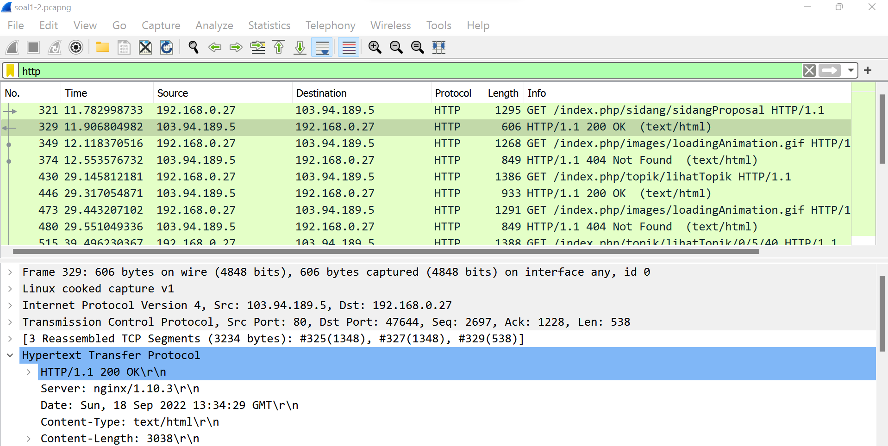
<h3>Soal 2</h3>
Ishaq sedang bingung mencari topik ta untuk semester ini , lalu ia datang ke website monta dan menemukan detail topik pada website “monta.if.its.ac.id” , judul TA apa yang dibuka oleh ishaq ?
<b>Langkah pengerjaan : </b>
<ul>
  <li>Buka soal1-2.pcapng</li>
  <li>Filter dengan "http.request.uri contains "detail""</li>
  <li>Klik pada salah satu hasil filter</li>
  <li>Buka menu file -> Export object</li>
  <li>Pilih http...</li>
  <li>Save file bertipe htlm</li>
  <li>Buka pada browser</li>
  <li>Terpampang topik fuse</li>
</ul>
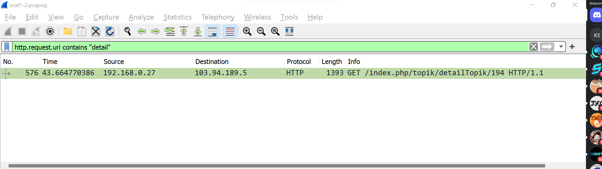
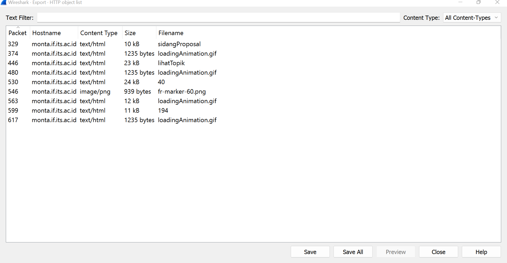
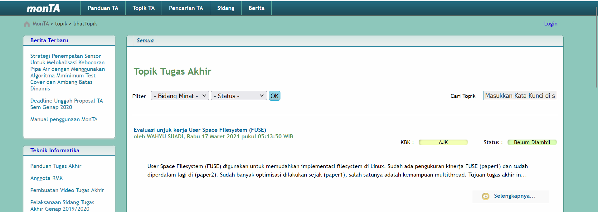
<h3>Soal 3</h3>
Filter sehingga wireshark hanya menampilkan paket yang menuju port 80!
<ul>
  <li>Buka soal3-6.pcapng</li>
  <li>Filter dengan "tcp.dstport == 80 || udp.dstport"</li>
  <li>Terpampang hasil filter paket yang menuju port 80</li>
</ul>
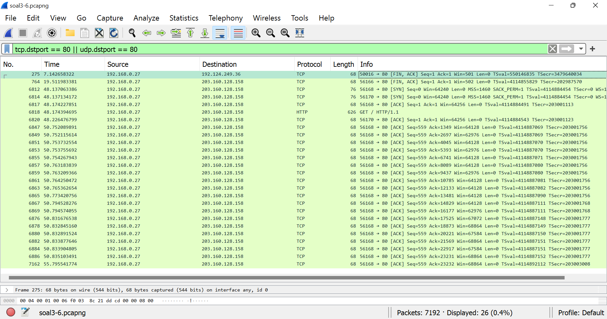
<h3>Soal 4</h3>
Filter sehingga wireshark hanya mengambil paket yang berasal dari port 21!
<ul>
  <li>Buka wireshark menuju port WIFI</li>
  <li>Buka capture options</li>
  <li>Filter dengan "src port 21"</li>
  <li>Terpampang hasil filter paket yang terambil dari port 21</li>
</ul>
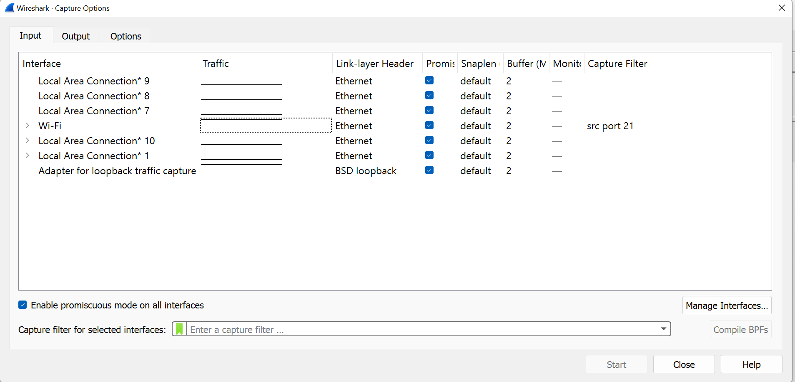
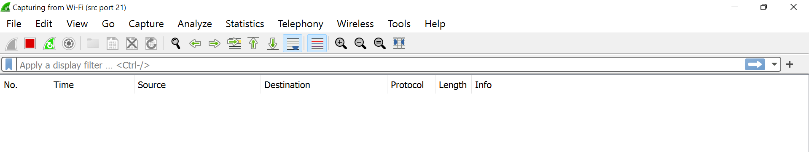
<h3>Soal 5</h3>
Filter sehingga wireshark hanya mengambil paket yang berasal dari port 443!
<ul>
  <li>Buka wireshark menuju port WIFI</li>
  <li>Buka capture options</li>
  <li>Filter dengan "src port "443"</li>
  <li>Terpampang hasil filter paket yang terambil dari port 443</li>
</ul>
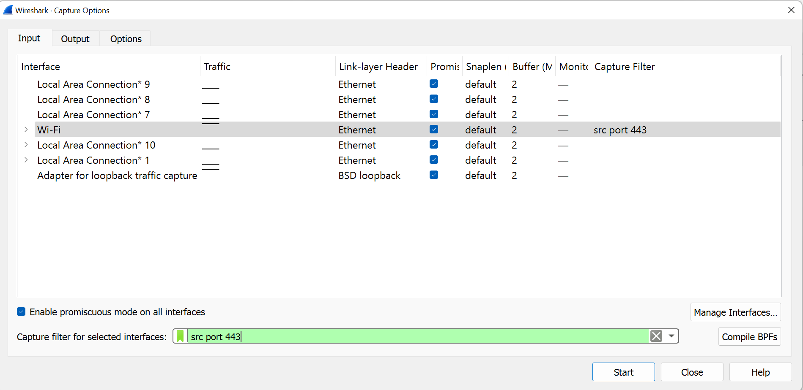
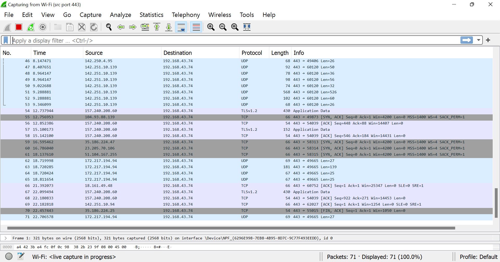
<h3>Soal 6</h3>
Filter sehingga wireshark hanya menampilkan paket yang menuju ke lipi.go.id !
<ul>
  <li>Buka soal3-6.pcapng</li>
  <li>Filter dengan "http contains "lipi.go.id""</li>
  <li>Terpampang hasil filter paket yang menuju lipi.go.id</li>
</ul>
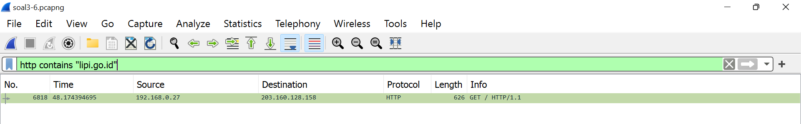
<h3>Soal 7</h3>
Filter sehingga wireshark hanya mengambil paket yang berasal dari ip kalian!
<b>Langkah pengerjaan : </b>
<ul>
  <li>Buka wireshark menuju port WIFI</li>
  <li>Copy IP yang diambil dari command ipconfig pada command line</li>
  <li>Filter dengan query ip.src == "ip masing-masing"</li>
</ul>
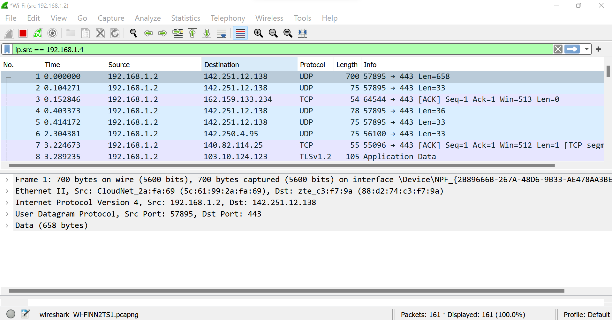
<h2>Untuk soal 8-10, silahkan baca cerita di bawah ini!</h2>
Di sebuah planet bernama Viltrumite, terdapat Kementerian Komunikasi dan Informatika yang baru saja menetapkan kebijakan baru. Dalam kebijakan baru tersebut, pemerintah dapat mengakses data pribadi masyarakat secara bebas jika memang dibutuhkan, baik dengan maupun tanpa persetujuan pihak yang bersangkutan. Sebagai mahasiswa yang sedang melaksanakan program magang di kementerian tersebut, kalian mendapat tugas berupa penyadapan percakapan mahasiswa yang diduga melakukan tindak kecurangan dalam kegiatan Praktikum Komunikasi Data dan Jaringan Komputer 2022. Selain itu, terdapat sebuah password rahasia (flag) yang diduga merupakan milik sebuah organisasi bawah tanah yang selama ini tidak sejalan dengan pemerintahan Planet Viltrumite. Tunggu apa lagi, segera kerjakan tugas magang tersebut agar kalian bisa mendapatkan pujian serta kenaikan jabatan di kementerian tersebut!
<h3>Soal 8</h3>
Telusuri aliran paket dalam file .pcap yang diberikan, cari informasi berguna berupa percakapan antara dua mahasiswa terkait tindakan kecurangan pada kegiatan praktikum. Percakapan tersebut dilaporkan menggunakan protokol jaringan dengan tingkat keandalan yang tinggi dalam pertukaran datanya sehingga kalian perlu menerapkan filter dengan protokol yang tersebut.
<b>Langkah pengerjaan : </b>
<ul>
  <li>Buka soal 8-10.pcapng</li>
  <li>Buka fitur Statistics -> Conversation pada Wireshark</li>
  <li>Karena percakapan memiliki beberapa paket yang dikirim antara dua endpoints, sehingga diurutkan dari paket yang terbesar</li>
  <li>Setelah diurutkan, bisa langsung dengan follow tcp stream, atau menjadikan conversation tersebut menjadi filter dengan cara Apply as filter -> Selected -> A ⇆ B</li>
  <li>Setelah di follow stream, bisa dilihat hasil dari percakapan yang dilakukan. Jumlah percakapan ada tiga buah, dan salah satunya merupakan hint untuk soal berikutnya</li>
</ul>
ip.addr==127.0.0.1 && tcp.port==60236 && ip.addr==127.0.1.1 && tcp.port==65432
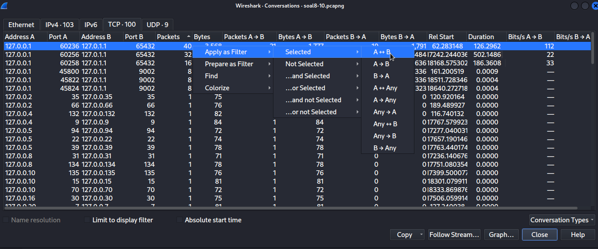
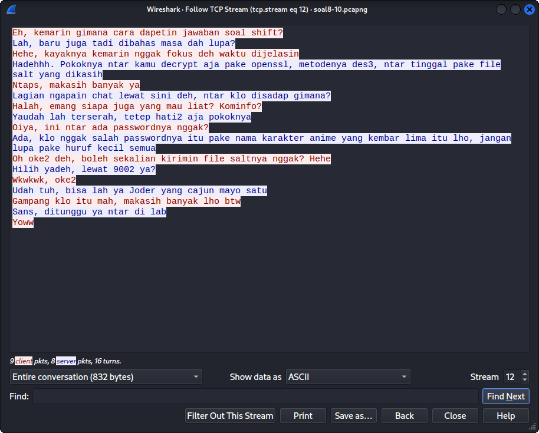

ip.addr==127.0.0.1 && tcp.port==60256 && ip.addr==127.0.1.1 && tcp.port==65432
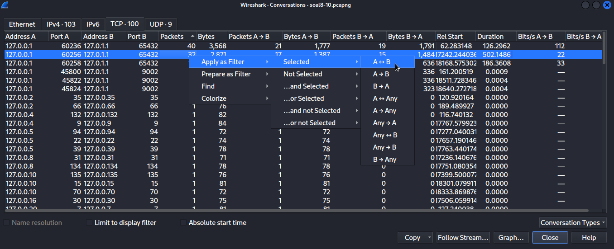
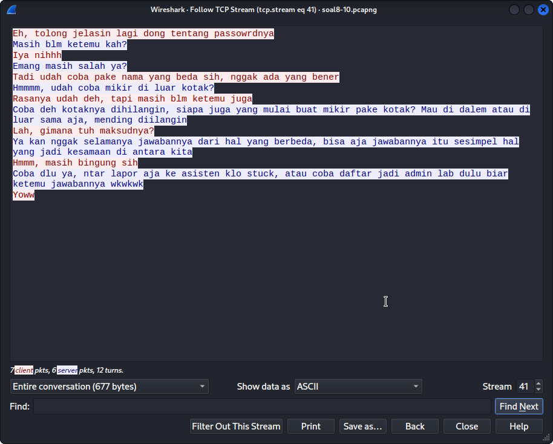

ip.addr==127.0.0.1 && tcp.port==60258 && ip.addr==127.0.1.1 && tcp.port==65432
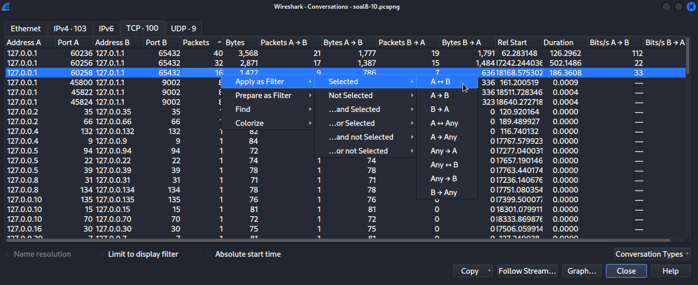
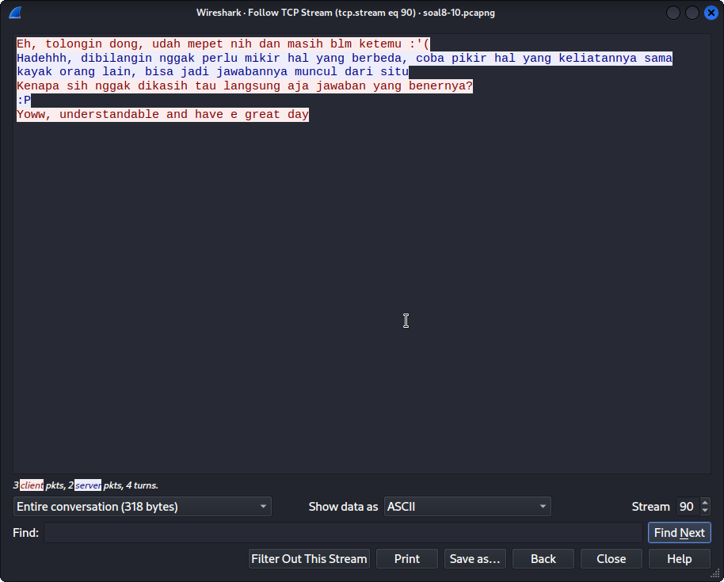
<h3>Soal 9</h3>
Terdapat laporan adanya pertukaran file yang dilakukan oleh kedua mahasiswa dalam percakapan yang diperoleh, carilah file yang dimaksud! Untuk memudahkan laporan kepada atasan, beri nama file yang ditemukan dengan format [nama_kelompok].des3 dan simpan output file dengan nama “flag.txt”.
<b>Langkah pengerjaan : </b>
<ul>
  <li>Dari salah satu percakapan pada soal 8, terdapat salah satu percakapan yang menunjukkan terjadi pengiriman file melalui port 9002</li>
  <li>Setelah kita filter menggunakan tcp.port==9002, terdapat salah satu paket yang berisi Salted file yang terenkripsi</li>
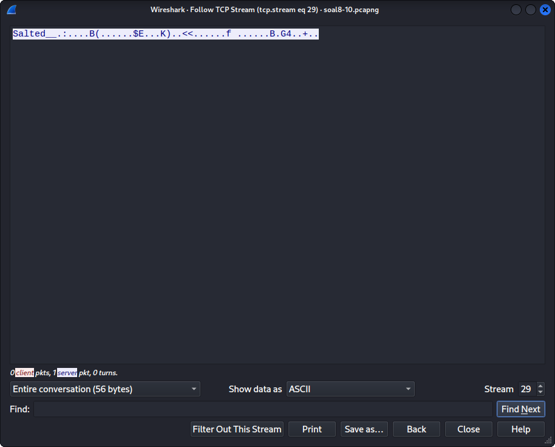
  <li>File tersebut bisa kita save as [nama_kelompok].des3 atau merubahnya menjadi raw terlebih dahulu sebelum disave jika bermasalah saat pendekripsian.
  <li>Setelah disave as .des3, bisa kita dekripsi menggunakan openssl metode des3, seperti yang dijelaskan pada salah satu percakapan pada nomor 8</li>
  <li>Untuk password yang kita gunakan adalah 'nakano' yaitu kemiripan dari kelima bersaudara</li>
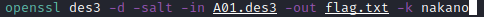
</ul>
<h3>Soal 10</h3>
Temukan password rahasia (flag) dari organisasi bawah tanah yang disebutkan di atas!
<ul>
Setelah didekripsi, didapatkan sebuah flag yaitu JaRkOm2022{8uK4N_CtF_k0k_h3h3h3} yang terdapat pada file flag.txt
</ul>
Note: Terkait soal nomor 9 dan 10, file yang didapatkan tidak perlu dikumpulkan, cukup tulis flag yang didapatkan ke dalam laporan kalian 🙏
